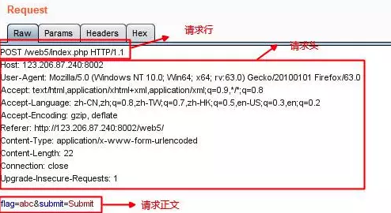

[[TOC]]

[TOC]


# http报文

HTTP报文是在HTTP应用程序之间发送的数据块。这些数据块以一些文本形式的 `元信息(meta-information)`开头，这些信息描述了报文的内容及含义，后面跟着可选的数据部分。

## 1. 报文组成

HTTP报文是简单的格式化数据块，每个报文都包含一条来自客户端的请求，或者一条来自服务器的响应，由3个部分组成：

- 起始行(start line)：对报文的描述，用来说明报文的目的或者执行的结果
- 首部(header)：报文的属性信息，提供报文的附加信息
- 主体(body)：可选，发送的数据

```http
HTTP/1.0 200 OK
content-type: text/plain
content-length: 19

Hi, I'm a message
```

起始行和首部是由行分隔的ASCII文本，主体是一个可选的数据块，可以是文本、二进制或者空。

## 2. 报文分类

HTTP报文分为两类：

**请求报文：**从客户端向服务器发送的HTTP报文。

**响应报文：**从服务器向客户端发送的HTTP报文。

### 2.1 请求报文

请求报文由4部分组成：

- 请求行

  由请求方法、URL、HTTP协议版本组成，他们之间用空格分开

- 请求头部

  由关键字和值对组成，每行一对，用来附加一些信息

- 空行

- 请求体

  可选，是HTTP要传输的内容，post、put等请求携带的参数也在请求体里




### 2.2 响应报文

响应报文由4个部分组成：

- 响应行

  由HTTP协议版本、状态码、状态码、状态码说明组成，如：`HTTP/1.1 200 OK`

- 响应头部

  跟请求头部一样，由关键字和值对组成，每行一对，用来附加一些信息

- 空行

- 响应体

  服务器响应的数据


响应报文例子：

```
curl -i www.baidu.com

HTTP/1.1 200 OK
Accept-Ranges: bytes
Cache-Control: private, no-cache, no-store, proxy-revalidate, no-transform
Connection: Keep-Alive
Content-Length: 2381
Content-Type: text/html
Date: Sun, 08 Sep 2019 16:44:37 GMT
Etag: "588604c8-94d"
Last-Modified: Mon, 23 Jan 2017 13:27:36 GMT
Pragma: no-cache
Server: bfe/1.0.8.18
Set-Cookie: BDORZ=27315; max-age=86400; domain=.baidu.com; path=/

<!DOCTYPE html>
<!--STATUS OK--><html>  </html>
```


## 3. 报文首部

首部也就是请求头和响应头内容。

1、首部用来说明客户端、服务器或报文主体的一些信息

2、首部可以有好几行，也可以没有

3、每个首部行由首部字段+`:` + 空格 + 值组成，如：`Connection: Keep-Alive`

4、每个首部行在结束的地方都有`CRLF`(回车和换行符)

5、首部字段分为4种：**通用首部字段、请求首部字段、响应首部字段、实体首部字段**

6、请求头部包含：**请求首部字段、通用首部字段、实体首部字段**

7、响应头部包含：**响应首部字段、通用首部字段、实体首部字段**


### 3.1 通用部首

通用部署字段是请求报文和响应报文都使用的字段。

| 首部              | 描述                                                         |
| ----------------- | ------------------------------------------------------------ |
| Cache-Control     | 控制缓存的行为,`Cache-Control: private, no-cache, no-store`  |
| Connection        | 客户端和服务器是否保持连接,`Connection: Keep-Alive`          |
| Date              | 创建报文的日期时间,`Date: Sun, 08 Sep 2019 16:44:37 GMT`     |
| Pragma            | http1.1之前的版本历史遗留字段，报文指令，`Pragma: no-cache`对应`Cahche-Control: no-cache` |
| Trailer           | 允许发送方在分块传输发送的消息后面添加额外的元信息，比如消息的完整性校验，消息的数字签名，或者消息经过处理之后的最终状态等。`Trailer: Expires` |
| Transfer-Encoding | 规定了传输报文主体采用的编码方式,`Transfer-Encoding: chunked` |
| Upgrade           | 用于检测HTTP协议，是否可使用更高版本的协议,`Upgrade: TLS/1.0, HTTP/1.1` |
| Via               | 显示了报文经过的中间节点（代理、网关）,`Via: 1.0 fred, 1.1 p.example.net` |
|                   |                                                              |
|                   |                                                              |
|                   |                                                              |
|                   |                                                              |
|                   |                                                              |
|                   |                                                              |


## 参考资料

[HTTP头字段 维基百科](https://zh.wikipedia.org/wiki/HTTP头字段)

[HTTP Headers MDN](https://developer.mozilla.org/zh-CN/docs/Web/HTTP/Headers)

[部首脑图](https://www.processon.com/view/link/58025201e4b0d6b27dd4c8af)

[可能是全网最全的http面试答案 掘金](https://juejin.im/post/5d032b77e51d45777a126183)