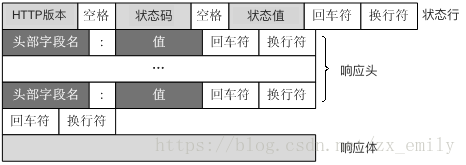

[[TOC]]

[TOC]


# http报文

HTTP报文是在HTTP应用程序之间发送的数据块。这些数据块以一些文本形式的 `元信息(meta-information)`开头，这些信息描述了报文的内容及含义，后面跟着可选的数据部分。

## 1. 报文组成

HTTP报文是简单的格式化数据块，每个报文都包含一条来自客户端的请求，或者一条来自服务器的响应，由3个部分组成：

- 起始行(start line)：对报文的描述，用来说明报文的目的或者执行的结果
- 首部(header)：报文的属性信息，提供报文的附加信息
- 主体(body)：可选，发送的数据

```http
HTTP/1.0 200 OK
content-type: text/plain
content-length: 19

Hi, I'm a message
```

起始行和首部是由行分隔的ASCII文本，主体是一个可选的数据块，可以是文本、二进制或者空。

## 2. 报文分类

HTTP报文分为两类：

**请求报文：**从客户端向服务器发送的HTTP报文。

**响应报文：**从服务器向客户端发送的HTTP报文。

### 2.1 请求报文

请求报文由4部分组成：

- 请求行

  由请求方法、URL、HTTP协议版本组成，他们之间用空格分开

- 请求头部

  由关键字和值对组成，每行一对，用来附加一些信息

- 空行

- 请求体

  可选，是HTTP要传输的内容，post、put等请求携带的参数也在请求体里


### 2.2 响应报文

响应报文由4个部分组成：

- 响应行

  由HTTP协议版本、状态码、状态码、状态码说明组成，如：`HTTP/1.1 200 OK`

- 响应头部

  跟请求头部一样，由关键字和值对组成，每行一对，用来附加一些信息

- 空行

- 响应体

  服务器响应的数据



响应报文例子：

```http
curl -i www.baidu.com

HTTP/1.1 200 OK
Accept-Ranges: bytes
Cache-Control: private, no-cache, no-store, proxy-revalidate, no-transform
Connection: Keep-Alive
Content-Length: 2381
Content-Type: text/html
Date: Sun, 08 Sep 2019 16:44:37 GMT
Etag: "588604c8-94d"
Last-Modified: Mon, 23 Jan 2017 13:27:36 GMT
Pragma: no-cache
Server: bfe/1.0.8.18
Set-Cookie: BDORZ=27315; max-age=86400; domain=.baidu.com; path=/

<!DOCTYPE html>
<!--STATUS OK--><html>  </html>
```


## 参考资料

[HTTP头字段 维基百科](https://zh.wikipedia.org/wiki/HTTP头字段)

[可能是全网最全的http面试答案 掘金](https://juejin.im/post/5d032b77e51d45777a126183)