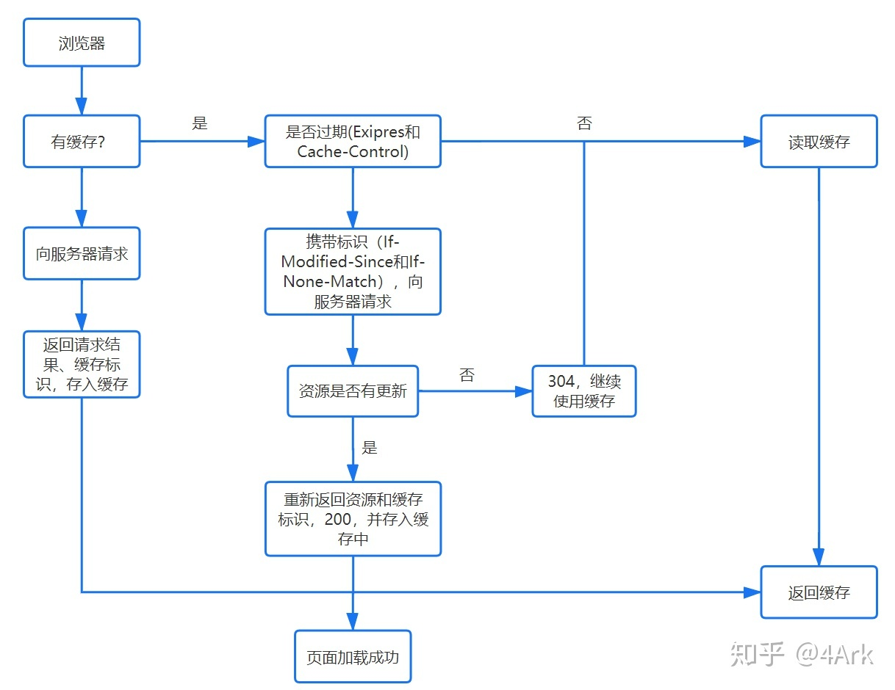
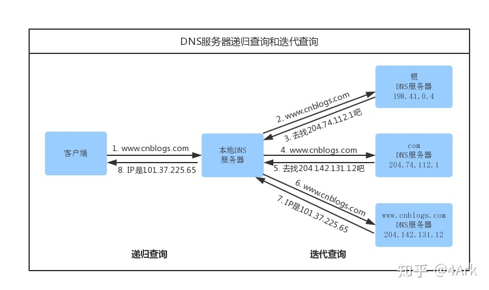
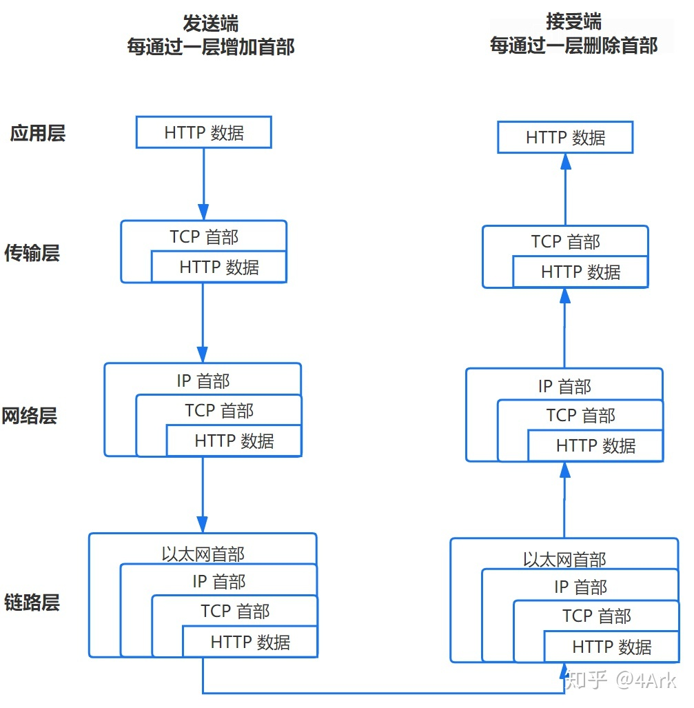

# 从输入URL到页面渲染过程

总体来说共分成一下几个过程：
URL输入
DNS解析
TCP连接
发送HTTP请求
服务器处理请求
服务器响应请求
浏览器解析渲染页面
连接结束

## 1. URL解析

### 1.1 地址解析

首先判断你输入的是一个合法的URL还是一个带搜索的关键词，并且根据你输入的内容自动完成、字符编码等操作。

### 1.2 HSTS

由于安全隐患，会使用`HSTS`来强制客户端使用HTTPS来访问页面。 [HSTS介绍](https://www.jianshu.com/p/caa80c7ad45c)

当你的网站均采用 HTTPS，并符合它的安全规范，就可以申请加入 HSTS 列表，之后用户不加 HTTPS 协议再去访问你的网站，浏览器都会定向到 HTTPS。

### 1.3 其他操作

浏览器还会进行一些额外的操作，比如安全检查、访问限制（之前国产浏览器限制 996.icu）。

### 1.4 缓存检查

## 2. DNS查询

基本步骤：

- 浏览器缓存

  浏览器会先检查是否在缓存中，没有则调用系统库函数进行查询。

- 操作系统缓存

  操作系统也有自己的DNS缓存，但在这之前，会检查域名是否存在本地的Host文件里，没有则向DNS服务器发送查询请求。

- 路由器缓存

  路由器也有自己的缓存。

- ISP DNS 缓存

  ISP DNS 就是在客户端电脑上设置的首选 DNS 服务器，它们在大多数情况下都会有缓存。

- **根域名服务器查询**

  在前面所有步骤没有缓存的情况下，本地 DNS 服务器会将请求转发到互联网上的根域。

下面这个图很好的诠释了整个流程：

需要注意的点：

1. 递归方式：一路查下去中间不返回，得到最终结果才返回信息（浏览器到本地DNS服务器的过程）
2. 迭代方式，就是本地DNS服务器到根域名服务器查询的方式。
3. 什么是 DNS 劫持
4. 前端 dns-prefetch 优化

## 3. TCP链接

TCP/IP 分为四层，在发送数据时，每层都要对数据进行封装：

## 参考资料：

[在浏览器输入 URL 回车之后发生了什么（超详细版）知乎](https://zhuanlan.zhihu.com/p/80551769)

[从浏览器输入一个 url 到页面渲染，涉及的知识点及优化点 github](https://github.com/sunyongjian/blog/issues/34)