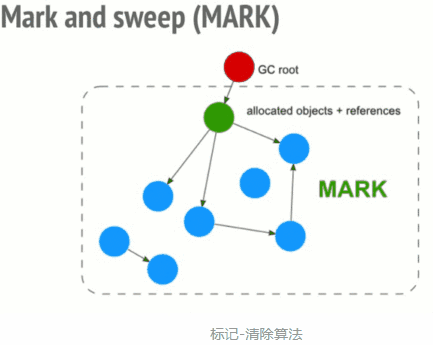

[TOC]

# JS中的垃圾回收和内存泄露

转载：https://segmentfault.com/a/1190000019035469

程序的运行需要内存。只要程序提出要求，操作系统或者运行时就必须供给内存。所谓的内存泄漏简单来说是不再用到的内存，没有及时释放。为了更好避免内存泄漏，我们先介绍Javascript垃圾回收机制。

在C与C++等语言中，开发人员可以直接控制内存的申请和回收。但是在Java、C#、JavaScript语言中，变量的内存空间的申请和释放都由程序自己处理，开发人员不需要关心。也就是说Javascript具有自动垃圾回收机制(Garbage Collecation)。

## 1. 垃圾回收的必要性

下面这段话引自《JavaScript权威指南（第四版）》

　　由于字符串、对象和数组没有固定大小，所有当他们的大小已知时，才能对他们进行动态的存储分配。JavaScript程序每次创建字符串、数组或对象时，解释器都必须分配内存来存储那个实体。只要像这样动态地分配了内存，最终都要释放这些内存以便他们能够被再用，否则，JavaScript的解释器将会消耗完系统中所有可用的内存，造成系统崩溃。

这段话解释了为什么需要系统需要垃圾回收，JavaScript不像C/C++，它有自己的一套垃圾回收机制。

JavaScript垃圾回收的机制很简单：找出不再使用的变量，然后释放掉其占用的内存，但是这个过程不是时时的，因为其开销比较大，所以垃圾回收器会按照固定的时间间隔周期性的执行。

```javascript
var a = "浪里行舟";
var b = "前端工匠";
var a = b; //重写a
```

这段代码运行之后，“浪里行舟”这个字符串失去了引用（之前是被a引用），系统检测到这个事实之后，就会释放该字符串的存储空间以便这些空间可以被再利用。

## 2. 垃圾回收机制

垃圾回收机制怎么知道，哪些内存不再需要呢？

垃圾回收有两种方法：**标记清除、引用计数**。引用计数不太常用，标记清除较为常用。

### 2.1 标记清除

**这是javascript中最常用的垃圾回收方式**。当变量进入执行环境是，就标记这个变量为“进入环境”。从逻辑上讲，永远不能释放进入环境的变量所占用的内存，因为只要执行流进入相应的环境，就可能会用到他们。当变量离开环境时，则将其标记为“离开环境”。

垃圾收集器在运行的时候会给存储在内存中的所有变量都加上标记。然后，它会去掉环境中的变量以及被环境中的变量引用的标记。而在此之后再被加上标记的变量将被视为准备删除的变量，原因是环境中的变量已经无法访问到这些变量了。最后。垃圾收集器完成内存清除工作，销毁那些带标记的值，并回收他们所占用的内存空间。



我们用个例子，解释下这个方法：

```javascript
var m = 0,n = 19 // 把 m,n,add() 标记为进入环境。
add(m, n) // 把 a, b, c标记为进入环境。
console.log(n) // a,b,c标记为离开环境，等待垃圾回收。
function add(a, b) {
  a++
  var c = a + b
  return c
}
```

### 2.2 引用计数

所谓"引用计数"是指语言引擎有一张"引用表"，保存了内存里面所有的资源（通常是各种值）的引用次数。如果一个值的引用次数是0，就表示这个值不再用到了，因此可以将这块内存释放。


上图中，左下角的两个值，没有任何引用，所以可以释放。

如果一个值不再需要了，引用数却不为0，垃圾回收机制无法释放这块内存，从而导致内存泄漏。

```javascript
var arr = [1, 2, 3, 4];
arr = [2, 4, 5]
console.log('浪里行舟');
```

上面代码中，数组[1, 2, 3, 4]是一个值，会占用内存。变量arr是仅有的对这个值的引用，因此引用次数为1。尽管后面的代码没有用到arr，它还是会持续占用内存。至于如何释放内存，我们下文介绍。

第三行代码中，数组[1, 2, 3, 4]引用的变量arr又取得了另外一个值，则数组[1, 2, 3, 4]的引用次数就减1，此时它引用次数变成0，则说明没有办法再访问这个值了，因而就可以将其所占的内存空间给收回来。

但是引用计数有个最大的问题： 循环引用

```javascript
function func() {
    let obj1 = {};
    let obj2 = {};

    obj1.a = obj2; // obj1 引用 obj2
    obj2.a = obj1; // obj2 引用 obj1
}
```

当函数 func 执行结束后，返回值为 undefined，所以整个函数以及内部的变量都应该被回收，但根据引用计数方法，obj1 和 obj2 的引用次数都不为 0，所以他们不会被回收。

要解决循环引用的问题，最好是在不使用它们的时候手工将它们设为空。上面的例子可以这么做：

```javascript
obj1 = null;
obj2 = null;
```

## 3. 哪些情况会引起内存泄漏？

虽然JavaScript会自动垃圾收集，但是如果我们的代码写法不当，会让变量一直处于“进入环境”的状态，无法被回收。下面列一下内存泄漏常见的几种情况：

### 3.1 意外的全局变量

```javascript
function foo(arg) {
    bar = "this is a hidden global variable";
}
```

bar没被声明,会变成一个全局变量,在页面关闭之前不会被释放。

另一种意外的全局变量可能由 `this` 创建:

```javascript
function foo() {
    this.variable = "potential accidental global";
}
// foo 调用自己，this 指向了全局对象（window）
foo();
```

在 JavaScript 文件头部加上 'use strict'，可以避免此类错误发生。启用严格模式解析 JavaScript ，避免意外的全局变量。

### 3.2 被遗忘的计时器或回调函数

```javascript
var someResource = getData();
setInterval(function() {
    var node = document.getElementById('Node');
    if(node) {
        // 处理 node 和 someResource
        node.innerHTML = JSON.stringify(someResource));
    }
}, 1000);
```

这样的代码很常见，如果id为Node的元素从DOM中移除，该定时器仍会存在，同时，因为回调函数中包含对someResource的引用，定时器外面的someResource也不会被释放。

### 3.3 闭包

```javascript
function bindEvent(){
  var obj=document.createElement('xxx')
  obj.onclick=function(){
    // Even if it is a empty function
  }
}
```

闭包可以维持函数内局部变量，使其得不到释放。上例定义事件回调时，由于是函数内定义函数，并且内部函数--事件回调引用外部函数，形成了闭包。

```javascript
// 将事件处理函数定义在外面
function bindEvent() {
  var obj = document.createElement('xxx')
  obj.onclick = onclickHandler
}
// 或者在定义事件处理函数的外部函数中，删除对dom的引用
function bindEvent() {
  var obj = document.createElement('xxx')
  obj.onclick = function() {
    // Even if it is a empty function
  }
  obj = null
}
```

解决之道，将事件处理函数定义在外部，解除闭包，或者在定义事件处理函数的外部函数中，删除对dom的引用。

### 3.4 没有清理的DOM元素引用

有时，保存 DOM 节点内部数据结构很有用。假如你想快速更新表格的几行内容，把每一行 DOM 存成字典（JSON 键值对）或者数组很有意义。此时，同样的 DOM 元素存在两个引用：一个在 DOM 树中，另一个在字典中。将来你决定删除这些行时，需要把两个引用都清除。

```javascript
var elements = {
    button: document.getElementById('button'),
    image: document.getElementById('image'),
    text: document.getElementById('text')
};
function doStuff() {
    image.src = 'http://some.url/image';
    button.click();
    console.log(text.innerHTML);
}
function removeButton() {
    document.body.removeChild(document.getElementById('button'));
    // 此时，仍旧存在一个全局的 #button 的引用
    // elements 字典。button 元素仍旧在内存中，不能被 GC 回收。
}
```

虽然我们用removeChild移除了button，但是还在elements对象里保存着#button的引用，换言之，DOM元素还在内存里面。

## 4. 内存泄漏的识别方法

新版本的chrome在 performance 中查看, 打开performance步骤：

- 页面右键 -> Inspect，在弹出的开发者工具中，选择 Performance
- 勾选 Screenshots 和 memory
- 左上角小圆点开始录制(record)
- 停止录制

图中 Heap 对应的部分就可以看到内存在周期性的回落也可以看到垃圾回收的周期,如果垃圾回收之后的最低值(我们称为min),min在不断上涨,那么肯定是有较为严重的内存泄漏问题。


避免内存泄漏的一些方式：

- 减少不必要的全局变量，或者生命周期较长的对象，及时对无用的数据进行垃圾回收
- 注意程序逻辑，避免“死循环”之类的
- 避免创建过多的对象

总而言之需要遵循一条**原则：不用了的东西要及时归还**


## 5. 垃圾回收的使用场景优化

### 5.1 数组array优化

将[]赋值给一个数组对象，是清空数组的捷径(例如： arr = [];),但是需要注意的是，这种方式又创建了一个新的空对象，并且将原来的数组对象变成了一小片内存垃圾！实际上，将数组长度赋值为0（arr.length = 0）也能达到清空数组的目的，并且同时能实现数组重用，减少内存垃圾的产生。

```javascript
const arr = [1, 2, 3, 4];
console.log('浪里行舟');
arr.length = 0  // 可以直接让数字清空，而且数组类型不变。
// arr = []; 虽然让a变量成一个空数组,但是在堆上重新申请了一个空数组对象。
```

### 5.2 对象尽量复用

对象尽量复用，尤其是在循环等地方出现创建新对象，能复用就复用。不用的对象，尽可能设置为null，尽快被垃圾回收掉。

```javascript
var t = {} // 每次循环都会创建一个新对象。
for (var i = 0; i < 10; i++) {
  // var t = {};// 每次循环都会创建一个新对象。
  t.age = 19
  t.name = '123'
  t.index = i
  console.log(t)
}
t = null //对象如果已经不用了，那就立即设置为null；等待垃圾回收。
```

### 5.3 在循环中的函数表达式，能复用最好放到循环外面

```
// 在循环中最好也别使用函数表达式。
for (var k = 0; k < 10; k++) {
  var t = function(a) {
    // 创建了10次  函数对象。
    console.log(a)
  }
  t(k)
}
// 推荐用法
function t(a) {
  console.log(a)
}
for (var k = 0; k < 10; k++) {
  t(k)
}
t = null
```

**给大家推荐一个好用的BUG监控工具[Fundebug](https://www.fundebug.com/)，欢迎免费试用！**

## 6. 参考资料

- [作者的blog](https://github.com/ljianshu/Blog)
- [JavaScript高级内幕（js高级）](https://ke.qq.com/course/276435)
- [JavaScript垃圾回收机制](https://www.cnblogs.com/hustskyking/archive/2013/04/27/garbage-collection.html)
- [JavaScript 内存泄漏教程](http://www.ruanyifeng.com/blog/2017/04/memory-leak.html)
- [JavaScript权威指南（第四版）](https://book.douban.com/subject/1232061/)
- [JavaScript 中的垃圾回收](https://zhuanlan.zhihu.com/p/23992332)
- [4类 JavaScript 内存泄漏及如何避免](http://www.ruanyifeng.com/blog/2017/04/memory-leak.html)

