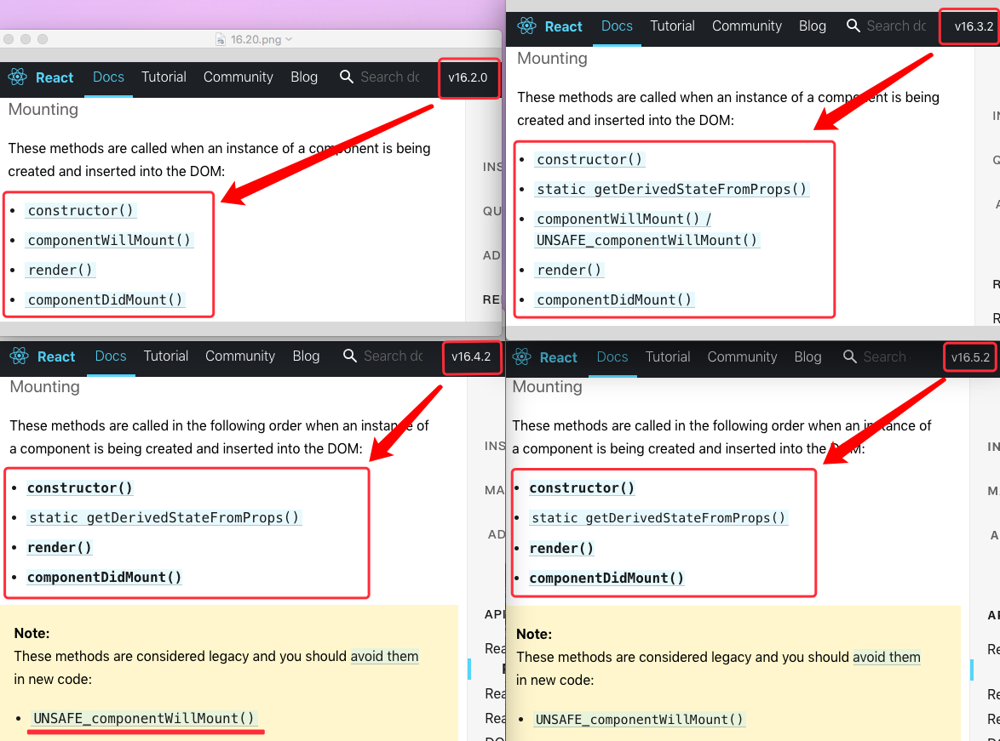
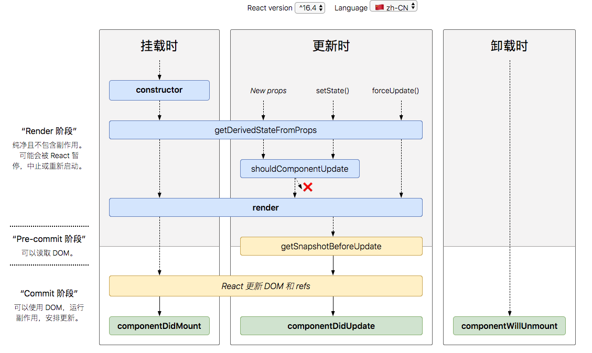

[[TOC]]

[TOC]

# react组件生命周期

react组件的生命周期就是react组件在运行过程中特定的阶段执行的方法，你可以重写这些方法，以便于在特定阶段做一些对应操作。

React 的生命周期包括三个阶段：

- Mounting（加载阶段）：第一次让组件出现在页面中的过程
- Updating（更新阶段）：mount 之后，如果数据有任何变动，就会来到 update 过程
- Unmounting（卸载阶段）当一个组件将要从页面中移除时，会进入 unmount 过程

到目前为止react最新的版本是16.9.0(2019年08月08号发布)，由于版本迭代了很多，所以生命周期也经历了大的变动，出现了新旧不同的生命周期，部分旧的生命周期支持到react的17版本后就停止使用了。


https://github.com/facebook/react

react生命周期变动和对应版本说明：

- react 16.2 版本和以前的生命周期是旧的生命周期
- react 16.3 版本开始出现了新的生命周期，把旧的不推荐使用的生命周期重命名了
- react 16.4 版本优化了`getDerivedStateFromProps`生命周期，后续react版本的生命周期都跟16.4的一样 

react[官网](https://reactjs.org)文档中关于 Mounting 加载阶段生命周期历史版本变动：




## 1. 新、旧生命周期对比

新的生命周期如下图所示：



[图片来源](http://projects.wojtekmaj.pl/react-lifecycle-methods-diagram/)

旧生命周期如下图：


[图片来源](https://hackernoon.com/reactjs-component-lifecycle-methods-a-deep-dive-38275d9d13c0?gi=630d5f23e5a)

新旧生命周期比对：

- 新生命周期弃用了componentWillMount、componentWillReceivePorps，componentWillUpdate
- 新生命周期新增了getDerivedStateFromProps、getSnapshotBeforeUpdate来代替弃用的三个钩子函数
- 弃用的生命周期钩子支持到react17版本后就会删除，现在可以使用，但不建议。

### 1.1 挂载阶段

当组件实例被创建并插入 DOM 中时，其生命周期调用顺序如下：

- constructor()：组件初始化调用
- static getDerivedStateFromProps(props, state)：props或state变化触发此方法
- render()：渲染挂载页面
- componentDidMount()：挂载结束后调用，此时可以获取到页面DOM元素了

> ***注意，下面的生命周期即将过时，不推荐使用：***
>
> UNSAFE_componentWillMount():在render()执行前被调用

### 1.2 更新阶段

当组件的 props 或 state 发生变化时会触发更新。组件更新的生命周期调用顺序如下：

- [static getDerivedStateFromProps()](https://zh-hans.reactjs.org/docs/react-component.html#static-getderivedstatefromprops)：props或state变化触发此方法
- [shouldComponentUpdate(nextProps, nextState)](https://zh-hans.reactjs.org/docs/react-component.html#shouldcomponentupdate)：触发的更新是否渲染钩子，
- [**render()**](https://zh-hans.reactjs.org/docs/react-component.html#render)：渲染页面
- [getSnapshotBeforeUpdate()](https://zh-hans.reactjs.org/docs/react-component.html#getsnapshotbeforeupdate)：在render()后，渲染提交到DOM节点之前调用
- [**componentDidUpdate()**](https://zh-hans.reactjs.org/docs/react-component.html#componentdidupdate)：更新结束后回调

> ***注意，下面的生命周期即将过时，不推荐使用：***
>
> [UNSAFE_componentWillUpdate()](https://zh-hans.reactjs.org/docs/react-component.html#unsafe_componentwillupdate): 在render()执行前被调用
>
> [UNSAFE_componentWillReceiveProps()](https://zh-hans.reactjs.org/docs/react-component.html#unsafe_componentwillreceiveprops):props更新后执行，


### 1.3 卸载阶段

当组件从 DOM 中移除时会调用如下方法：

- [**componentWillUnmount()**](https://zh-hans.reactjs.org/docs/react-component.html#componentwillunmount)：组件挂载前执行


### 1.4 错误处理

当渲染过程，生命周期，或子组件的构造函数中抛出错误时，会调用如下方法：

- [`static getDerivedStateFromError()`](https://zh-hans.reactjs.org/docs/react-component.html#static-getderivedstatefromerror)
- [`componentDidCatch()`](https://zh-hans.reactjs.org/docs/react-component.html#componentdidcatch)


## 2. 挂载阶段生命周期函数说明

### 2.1 constructor(props):初始化构造函数

**如果不初始化state或不进行方法绑定，则不需要为react组件实现构造函数。**

在react组件挂载之前，会调用它的构造函数。在React.Component子类实现构造函数时，函数第一行应该是`super(props)`，否则，`this.props`在构造函数中可能会出现未定义bug。

通常，constructor()函数仅用于以下情况：

- 给`this.state`赋值来初始化`state`。
- 为方法绑定`this`。
- 初始化一些自定义属性。

在`constructor()`函数中，不要调用`setState()`方法。如果组件内部需要使用state，请直接在构造函数中以`this.state`形式初始化：

```javascript
constructor(props) {
  super(props);
  // 不要在这里调用 this.setState()
  this.state = { counter: 0 };
  this.handleClick = this.handleClick.bind(this);
}
```

只有构造函数中才能直接为`this.state`赋值。其他方法中要使用`this.setState()`替代。

要避免在构造函数中引入任何副作用的订阅。如遇到此场景，请将对应的操作放置在`componentDidMount`中。

> ***注意：***
>
> 在构造函数中把props的值赋值给state，仅仅是给state初始化用(如果props传值了)。
>
> ```javascript
> constructor(props) {
>  super(props);
>  this.state = { color: props.color };
> }
> ```
>
> 在组件更新阶段，更新 prop 中的 `color` 时，并不会影响 state.
>
> **只有在你刻意忽略 prop 更新的情况下使用。**此时，应将 prop 重命名为 `initialColor` 或 `defaultColor`。必要时，你可以[修改它的 `key`](https://zh-hans.reactjs.org/blog/2018/06/07/you-probably-dont-need-derived-state.html#recommendation-fully-uncontrolled-component-with-a-key)，以强制“重置”其内部 state。


### 2.2 getDerivedStateFromProps()

```javascript
static getDerivedStateFromProps(props, state)
```

`getDerivedStateFromProps` 会在调用 render 方法之前调用，并且在初始挂载及后续更新时都会被调用。它应返回一个对象来更新 state，如果返回 null 则不更新任何内容。

此方法适用于state的值在任何时候都取决于props时调用。

此方法无权访问组件实例。如果你需要，可以通过提取组件 props 的纯函数及 class 之外的状态，在`getDerivedStateFromProps()`和其他 class 方法之间重用代码。

> ***注意：***
>
> 不管原因是什么，都会在*每次*渲染前触发此方法。这与 `UNSAFE_componentWillReceiveProps` 形成对比，后者仅在父组件重新渲染时触发，而不是在内部调用 `setState` 时。
>
> 如果`getDerivedStateFromProps`和`UNSAFE_componentWillReceiveProps`都写了，那么只会执行`getDerivedStateFromProps`。

### 2.3 render()

**`render()`方法是react类组件中唯一必须实现的方法。**

当`render()`被调用时，它会检查`this.props`和`this.state`的变化并返回以下类型之一：

- **React元素：**通常是通过JSX语法创建。例如，`<div />`会被React渲染为DOM节点，`<MyComponent />`会被React渲染为自定义组件，`<div />`、`<MyComponent />`均为 React元素。
- **数组或fragments：**render 方法可以返回多个元素，fragments是可以去掉render只能返回一个元素的限制。欲了解更多详细信息，请参阅 [fragments](https://zh-hans.reactjs.org/docs/fragments.html) 文档。
- **Portals：**可以渲染子节点到不同的DOM子树中。欲了解更多详细信息，请参阅有关 [portals](https://zh-hans.reactjs.org/docs/portals.html) 的文档。
- **字符串或数值类型：**他们在DOM中会被渲染为文本节点。
- **布尔类型或null：**什么都不渲染。主要用于支持返回`condition && <Child />`的模式，其中`condition`为布尔类型。

`render()`函数应该为纯函数，也就是在不修改`state`的情况下，每次调用都返回相同的结果，并且它不会直接与浏览器交互。

如果需要与浏览器进行交互，请在`componentDidMount()`或其他生命周期方法中执行你的操作。保持`render()`为纯函数，可以使组件更容易思考。

> ***注意：***
>
> 如果`shouldComponentUpdate()`返回false，则不会调用`render()`。


### 2.4 componentDidMount()

`componentDidMount()` 会在组件挂载后（插入 DOM 树中）立即调用。依赖于 DOM 节点的初始化应该放在这里。如需通过网络请求获取数据，此处是实例化请求的好地方。

这个方法是比较适合添加订阅的地方。如果添加了订阅，请不要忘记在 `componentWillUnmount()` 里取消订阅

你可以在 `componentDidMount()` 里**可以直接调用 setState()**。它将触发额外渲染，但此渲染会发生在浏览器更新屏幕之前。如此保证了即使在 `render()` 两次调用的情况下，用户也不会看到中间状态。请谨慎使用该模式，因为它会导致性能问题。通常，你应该在 `constructor()` 中初始化 state。如果你的渲染依赖于 DOM 节点的大小或位置，比如实现 modals 和 tooltips 等情况下，你可以使用此方式处理。

## 3. 更新阶段生命周期函数说明

### 3.1 getDerivedStateFromProps()

```javascript
static getDerivedStateFromProps(props, state)
```

使用说明见上面

### 3.2 shouldComponentUpdate()

```javascript
shouldComponentUpdate(nextProps, nextState)
```

当 props 或 state 发生变化时，`shouldComponentUpdate()` 会在render渲染执行之前被调用。返回值默认为 true。首次渲染或使用 `forceUpdate()` 时不会调用该方法。

根据 `shouldComponentUpdate()` 的返回值，判断 React 组件的输出是否受当前 state 或 props 更改的影响。默认行为是每次 state 或 props 发生变化组件都会重新渲染。大部分情况下，你应该遵循默认行为。

此方法仅作为**性能优化的方式**而存在。不要企图依靠此方法来“阻止”渲染，因为这可能会产生 bug。你应该**考虑使用内置的 PureComponent 组件**，而不是手动编写 `shouldComponentUpdate()`。`PureComponent` 会对 props 和 state 进行浅层比较，并减少了跳过必要更新的可能性。

如果你一定要手动编写此函数，可以将 `this.props` 与 `nextProps` 以及 `this.state` 与`nextState` 进行比较，并返回 `false` 以告知 React 可以跳过更新。请注意，返回 `false` 并不会阻止子组件在 state 更改时重新渲染。

我们不建议在 `shouldComponentUpdate()` 中进行深层比较或使用 `JSON.stringify()`。这样非常影响效率，且会损害性能。

目前，如果 `shouldComponentUpdate()` 返回 `false`，则不会调用 [`UNSAFE_componentWillUpdate()`](https://zh-hans.reactjs.org/docs/react-component.html#unsafe_componentwillupdate)，[`render()`](https://zh-hans.reactjs.org/docs/react-component.html#render) 和 [`componentDidUpdate()`](https://zh-hans.reactjs.org/docs/react-component.html#componentdidupdate)。后续版本，React 可能会将 `shouldComponentUpdate` 视为提示而不是严格的指令，并且，当返回 `false` 时，仍可能导致组件重新渲染。

### 3.3 render()

参考上面的render。

### 3.4 getSnapshotBeforeUpdate()

```javascript
getSnapshotBeforeUpdate(prevProps, prevState)
```

getSnapshotBeforeUpdate() 在`render()`之后，渲染输出(提交到DOM节点)之前调用。它使组件能在发生更改之前从 DOM 中捕获一些信息（例如，滚动位置）。此生命周期的任何返回值将作为参数传递给 `componentDidUpdate()`。

此用法并不常见，但它可能出现在 UI 处理中，如需要以特殊方式处理滚动位置的聊天线程等。

应返回 snapshot 的值（或 `null`）。

一个使用例子：

```javascript
class ScrollingList extends React.Component {
  constructor(props) {
    super(props);
    this.listRef = React.createRef();
  }
  getSnapshotBeforeUpdate(prevProps, prevState) {
    // 我们是否在 list 中添加新的 items ？
    // 捕获滚动位置以便我们稍后调整滚动位置。
    if (prevProps.list.length < this.props.list.length) {
      const list = this.listRef.current;
      return list.scrollHeight - list.scrollTop;
    }
    return null;
  }
  componentDidUpdate(prevProps, prevState, snapshot) {
    // 如果我们 snapshot 有值，说明我们刚刚添加了新的 items，
    // 调整滚动位置使得这些新 items 不会将旧的 items 推出视图。
    //（这里的 snapshot 是 getSnapshotBeforeUpdate 的返回值）
    if (snapshot !== null) {
      const list = this.listRef.current;
      list.scrollTop = list.scrollHeight - snapshot;
    }
  }
  render() {
    return (
      <div ref={this.listRef}>{/* ...contents... */}</div>
    );
  }
}
```

在上述示例中，重点是从 `getSnapshotBeforeUpdate` 读取 `scrollHeight` 属性，因为 “render” 阶段生命周期（如 `render`）和 “commit” 阶段生命周期（如 `getSnapshotBeforeUpdate` 和 `componentDidUpdate`）之间可能存在延迟。

### 3.5 componentDidUpdate()

```javascript
componentDidUpdate(prevProps, prevState, snapshot)
```

`componentDidUpdate()` 会在更新后会被立即调用。首次渲染不会执行此方法。

当组件更新后，可以在此处对 DOM 进行操作。如果你对更新前后的 props 进行了比较，也可以选择在此处进行网络请求。（例如，当 props 未发生变化时，则不会执行网络请求）。

```javascript
componentDidUpdate(prevProps) {
  // 典型用法（不要忘记比较 props）：
  if (this.props.userID !== prevProps.userID) {
    // 发起请求
  }
}
```

你也可以在 `componentDidUpdate()` 中**直接调用 setState()**，但请注意**它必须被包裹在一个条件语件里**，正如上述的例子那样进行处理，否则会导致死循环。它还会导致额外的重新渲染，虽然用户不可见，但会影响组件性能。不要将 props “镜像”给 state，请考虑直接使用 props。 欲了解更多有关内容，请参阅[为什么 props 复制给 state 会产生 bug](https://zh-hans.reactjs.org/blog/2018/06/07/you-probably-dont-need-derived-state.html)。

如果组件实现了 `getSnapshotBeforeUpdate()` 生命周期（不常用），则它的返回值将作为 `componentDidUpdate()` 的第三个参数 “snapshot” 参数传递。否则此参数将为 undefined。

> ***注意：***
>
> 如果`shouldComponentUpdate()`返回值为false，则不会调用`componentDidUpdate()`。

## 4. 卸载阶段生命周期函数说明

### 4.1 componentWillUnmount()

```javascript
componentWillUnmount()
```

`componentWillUnmount()` 会在组件卸载及销毁之前直接调用。在此方法中执行必要的清理操作，例如，清除 timer，取消网络请求或清除在 `componentDidMount()` 中创建的订阅等。

`componentWillUnmount()` 中**不应调用 setState()**，因为该组件将永远不会重新渲染。组件实例卸载后，将永远不会再挂载它。

## 5. 弃用的生命周期

一下介绍的生命周期方法为过时的方法，这些方法仍然有效，但不建议在新代码中使用它们。过时的方法将支持到react17版本中，然后就会删除。

- react 16.x版本：启用弃用警告`componentWillMount`，`componentWillReceiveProps`和`componentWillUpdate`。（旧的生命周期名称和新的别名都可以在此发行版中使用，但是旧名称将记录DEV模式警告。）
- **react 17.0 版本**：删除`componentWillMount`，`componentWillReceiveProps`和`componentWillUpdate`。（从现在开始，只有新的“ UNSAFE_”生命周期名称将起作用。）

### 5.1 UNSAFE_componentWillMount()

```javascript
UNSAFE_componentWillMount()
```

> ***注意：***
>
> 此生命周期之前名为 `componentWillMount`。该名称将继续使用至 React 17。

`UNSAFE_componentWillMount()` 在挂载之前被调用。它在 `render()` 之前调用，因此在此方法中同步调用 `setState()` 不会触发额外渲染。通常，我们建议使用 `constructor()` 来初始化 state。

避免在此方法中引入任何副作用或订阅。如遇此种情况，请改用 `componentDidMount()`。

此方法是服务端渲染唯一会调用的生命周期函数。

### 5.2 UNSAFE_componentWillReceiveProps()

```javascript
UNSAFE_componentWillReceiveProps(nextProps)
```

> ***注意：***
>
> 此生命周期之前名为 `componentWillReceiveProps`。该名称将继续使用至 React 17。
>
> 使用此生命周期方法通常会出现 bug 和不一致性：
>
> - 如果你需要**执行副作用**（例如，数据提取或动画）以响应 props 中的更改，请改用 [`componentDidUpdate`](https://zh-hans.reactjs.org/docs/react-component.html#componentdidupdate) 生命周期。
> - 如果你使用 `componentWillReceiveProps` **仅在 prop 更改时重新计算某些数据**，请[使用 memoization helper 代替](https://zh-hans.reactjs.org/blog/2018/06/07/you-probably-dont-need-derived-state.html#what-about-memoization)。
> - 如果你使用 `componentWillReceiveProps` 是为了**在 prop 更改时“重置”某些 state**，请考虑使组件[完全受控](https://zh-hans.reactjs.org/blog/2018/06/07/you-probably-dont-need-derived-state.html#recommendation-fully-controlled-component)或[使用 `key` 使组件完全不受控](https://zh-hans.reactjs.org/blog/2018/06/07/you-probably-dont-need-derived-state.html#recommendation-fully-uncontrolled-component-with-a-key) 代替。

`UNSAFE_componentWillReceiveProps()` 会在已挂载的组件接收新的 props 之前被调用。如果你需要更新状态以响应 prop 更改（例如，重置它），你可以比较 `this.props` 和 `nextProps` 并在此方法中使用 `this.setState()` 执行 state 转换。

请注意，如果父组件导致组件重新渲染，即使 props 没有更改，也会调用此方法。如果只想处理更改，请确保进行当前值与变更值的比较。

在[挂载](https://zh-hans.reactjs.org/docs/react-component.html#mounting)过程中，React 不会针对初始 props 调用 `UNSAFE_componentWillReceiveProps()`。组件只会在组件的 props 更新时调用此方法。调用 `this.setState()` 通常不会触发 `UNSAFE_componentWillReceiveProps()`。

### 5.3 UNSAFE_componentWillUpdate()

```javascript
UNSAFE_componentWillUpdate(nextProps, nextState)
```

> ***注意：***
>
> 此生命周期之前名为 `componentWillUpdate`。该名称将继续使用至 React 17。
>
> 如果`shouldComponentUpdate()`返回 false，则不会调用`UNSAFE_componentWillUpdate()`。

当组件收到新的 props 或 state 时，会在渲染之前调用 `UNSAFE_componentWillUpdate()`。使用此作为在更新发生之前执行准备更新的机会。初始渲染不会调用此方法。

注意，你不能此方法中调用 `this.setState()`；在 `UNSAFE_componentWillUpdate()` 返回之前，你也不应该执行任何其他操作（例如，dispatch Redux 的 action）触发对 React 组件的更新

通常，此方法可以替换为 `componentDidUpdate()`。如果你在此方法中读取 DOM 信息（例如，为了保存滚动位置），则可以将此逻辑移至 `getSnapshotBeforeUpdate()` 中。


## 6. react组件其他API

### 6.1 forceUpdate()

```javascript
component.forceUpdate(callback)
```

默认情况下，当组件的 state 或 props 发生变化时，组件将重新渲染。如果 `render()` 方法依赖于其他数据，则可以调用 `forceUpdate()` 强制让组件重新渲染。

调用 `forceUpdate()` 将致使组件调用 `render()` 方法，此操作会跳过该组件的 `shouldComponentUpdate()`。但其子组件会触发正常的生命周期方法，包括 `shouldComponentUpdate()` 方法。如果标记发生变化，React 仍将只更新 DOM。

通常你应该避免使用 `forceUpdate()`，尽量在 `render()` 中使用 `this.props` 和 `this.state`。


### 6.2 setState()

```javascript
setState(updater[, callback])
```

`setState()` 将对组件 state 的更改排入队列，并通知 React 需要使用更新后的 state 重新渲染此组件及其子组件。这是用于更新用户界面以响应事件处理器和处理服务器数据的主要方式

将 `setState()` 视为*请求*而不是立即更新组件的命令。为了更好的感知性能，React 会延迟调用它，然后通过一次传递更新多个组件。React 并不会保证 state 的变更会立即生效。

`setState()` 并不总是立即更新组件。它会批量推迟更新。这使得在调用 `setState()` 后立即读取 `this.state` 成为了隐患。为了消除隐患，请使用 `componentDidUpdate` 或者 `setState` 的回调函数（`setState(updater, callback)`），这两种方式都可以保证在应用更新后触发。如需基于之前的 state 来设置当前的 state，请阅读下述关于参数 `updater` 的内容。

除非 `shouldComponentUpdate()` 返回 `false`，否则 `setState()` 将始终执行重新渲染操作。如果可变对象被使用，且无法在 `shouldComponentUpdate()` 中实现条件渲染，那么仅在新旧状态不一时调用 `setState()`可以避免不必要的重新渲染

参数一为带有形式参数的 `updater` 函数：

```javascript
(state, props) => stateChange
```

`state` 是对应用变化时组件状态的引用。当然，它不应直接被修改。你应该使用基于 `state` 和 `props` 构建的新对象来表示变化。例如，假设我们想根据 `props.step` 来增加 state：

```
this.setState((state, props) => {
  return {counter: state.counter + props.step};
});
```

updater 函数中接收的 `state` 和 `props` 都保证为最新。updater 的返回值会与 `state` 进行浅合并。

`setState()` 的第二个参数为可选的回调函数，它将在 `setState` 完成合并并重新渲染组件后执行。通常，我们建议使用 `componentDidUpdate()` 来代替此方式。

`setState()` 的第一个参数除了接受函数外，还可以接受对象类型：

```
setState(stateChange[, callback])
```

`stateChange` 会将传入的对象浅层合并到新的 state 中，例如，调整购物车商品数：

```
this.setState({quantity: 2})
```

这种形式的 `setState()` 也是异步的，并且在同一周期内会对多个 `setState` 进行批处理。例如，如果在同一周期内多次设置商品数量增加，则相当于：

```
Object.assign(
  previousState,
  {quantity: state.quantity + 1},
  {quantity: state.quantity + 1},
  ...
)
```

后调用的 `setState()` 将覆盖同一周期内先调用 `setState` 的值，因此商品数仅增加一次。如果后续状态取决于当前状态，我们建议使用 updater 函数的形式代替：

```
this.setState((state) => {
  return {quantity: state.quantity + 1};
});
```


## 7. react Class属性

### 7.1 defaultProps

`defaultProps` 可以为 Class 组件添加默认 props。这一般用于 props 未赋值，但又不能为 null 的情况。例如：

```javascript
class CustomButton extends React.Component {
  // ...
}

CustomButton.defaultProps = {
  color: 'blue'
};
```

如果未提供 `props.color`，则默认设置为 `'blue'`

```javascript
  render() {
    return <CustomButton /> ; // props.color 将设置为 'blue'
  }
```

如果 `props.color` 被设置为 `null`，则它将保持为 `null`

```jsx
  render() {
    return <CustomButton color={null} /> ; // props.color 将保持是 null
  }
```


### 7.2 displayName

`displayName` 字符串多用于调试消息。通常，你不需要设置它，因为它可以根据函数组件或 class 组件的名称推断出来。如果调试时需要显示不同的名称或创建高阶组件，

```
class CustomButton extends React.Component {
  // ...
}

CustomButton.displayName = "ppp";
```


## 参考资料

[React.Component 官方文档](https://zh-hans.reactjs.org/docs/react-component.html)

[react 16.4 生命周期图](http://projects.wojtekmaj.pl/react-lifecycle-methods-diagram/)

[React-新的生命周期（React16版本） segmentfault](https://segmentfault.com/a/1190000016617400)

[详解React生命周期(包括react16版) 简书](https://www.jianshu.com/p/514fe21b9914)